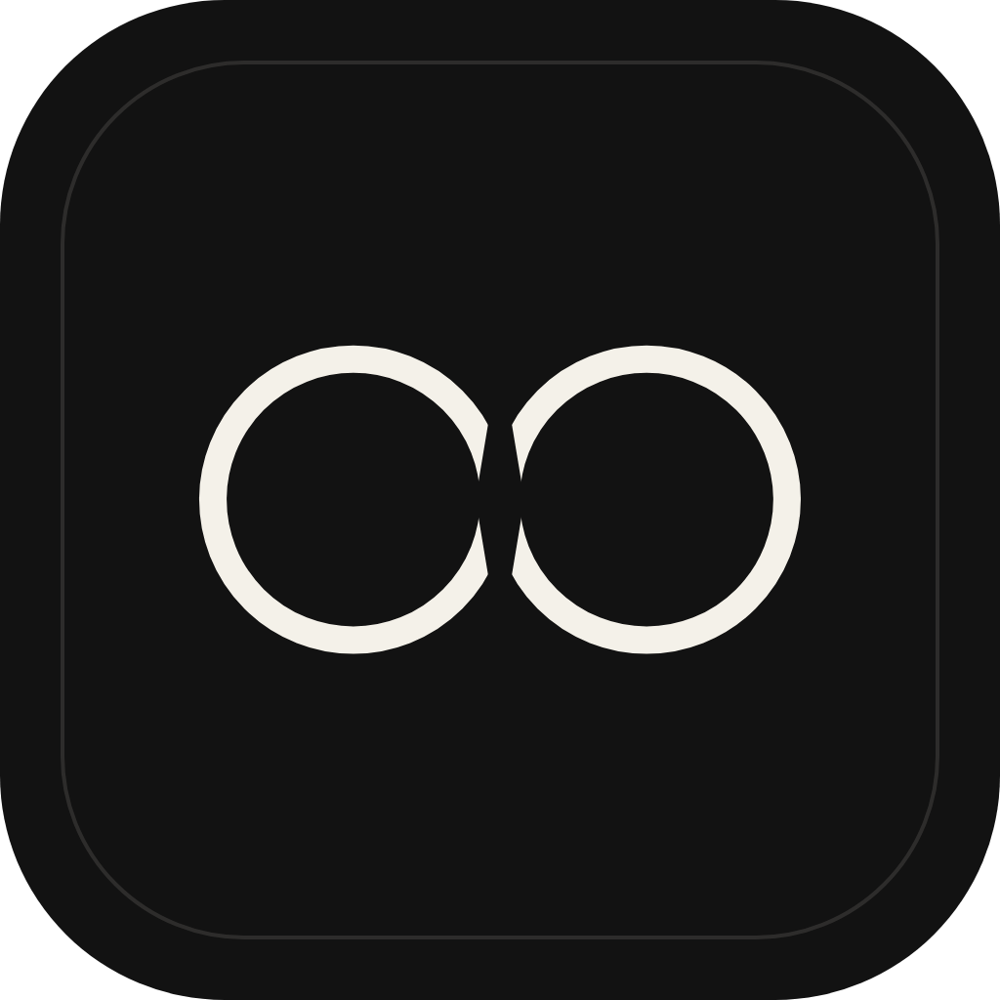
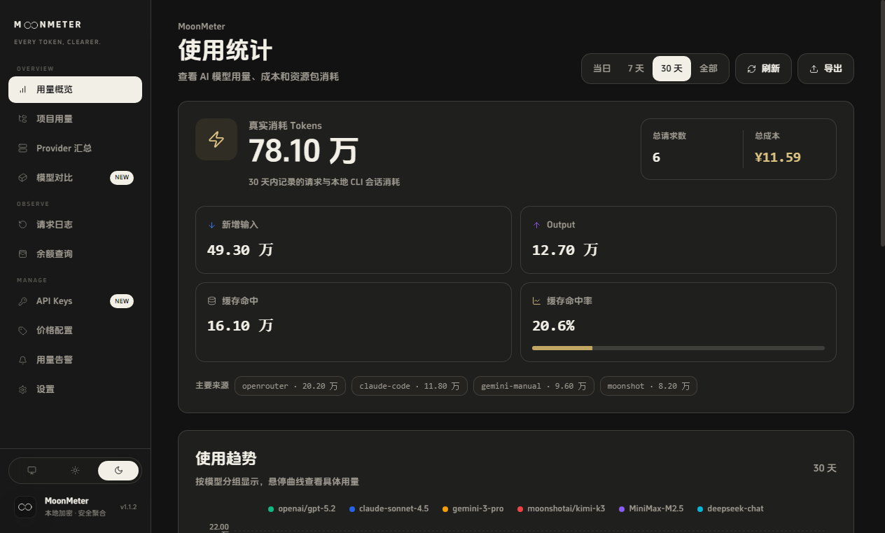

<div align="center">
  
  <h1>MoonMeter</h1>
  <p><strong>Every token, in a clearer light.</strong></p>
  <p>A local-first LLM usage, balance, and cost workspace for multi-model developers.</p>

  <p>
    
    
    
    
  </p>

  <p>
    <a href="./README.md">中文</a> ·
    <a href="./design/ARCHITECTURE.md">Architecture</a> ·
    <a href="./design/PROVIDERS.md">Providers</a> ·
    <a href="./drive/docs/ONE-CLICK-SERVER.md">Self-hosted sync</a> ·
    <a href="https://github.com/2488652el/MoonMeter/releases">Downloads</a>
  </p>
</div>


## What is MoonMeter?

When you use Claude Code, Codex CLI, multiple model APIs, and gateway services, usage, balances, token plans, and real costs end up scattered across different products. MoonMeter brings them together in one Windows and macOS desktop application while keeping data on your machine by default.

It is not another chat client. It is a focused dashboard for three questions:

- Where did the tokens go?
- How much quota is left?
- What did each model and project actually cost?

## Core capabilities

| Capability         | What it does                                                                                  |
| ------------------ | --------------------------------------------------------------------------------------------- |
| Usage overview     | Combines API requests and local CLI sessions into input, output, cache, and cost trends       |
| Project analytics  | Shows tokens, model mix, active dates, and normalized cost by coding project                  |
| Provider summary   | Aggregates requests, tokens, spend, and model distribution across providers                   |
| Model comparison   | Compares spend ranking, providers, token composition, request averages, and pricing coverage  |
| API key management | Encrypts credentials locally with Electron `safeStorage`; the UI only sees key tails          |
| Balances and plans | Reads API balances, coding plans, token packages, organization usage, and gateway quota       |
| Request logs       | Filters, paginates, inspects, and exports request-level CSV for API and local-session sources |
| Model pricing      | Searches official and custom prices with currency conversion, scopes, and change review       |
| Usage alerts       | Evaluates rules based on remaining balance, percentage, or consumption state                  |
| Multi-device sync  | Optionally syncs settings, prices, and balance snapshots with local backup support            |

## Moonlit paper interface

MoonMeter uses warm paper surfaces, black-and-white contrast, hairline borders, and restrained gold data accents. Appearance can follow the system or be set to light or dark. Long animations respect `prefers-reduced-motion`.

| API Keys                                      | Request logs                                           |
| --------------------------------------------- | ------------------------------------------------------ |
|  |  |

| Dark dashboard                                                       | Sync settings                                            |
| -------------------------------------------------------------------- | -------------------------------------------------------- |
|  |  |

## Privacy and security

- API keys are encrypted by the Electron main process with the operating system's `safeStorage` facility.
- The sandboxed renderer cannot access Node.js, the filesystem, SQLite, raw IPC, or plaintext secrets.
- Renderer-to-main payloads are validated through shared schemas.
- Claude Code and Codex CLI logs are parsed incrementally and read-only.
- No telemetry is added by default. Cloud sync is optional and can be self-hosted.
- The SQLite database lives under Electron's user-data directory, outside the installation directory.

See [design/ARCHITECTURE.md](./design/ARCHITECTURE.md) for the full process and trust boundaries.

## Quick start

### Requirements

- Node.js 24 (the repository includes an `.nvmrc`)
- npm
- Windows 10/11 or a supported macOS version

### Run locally

```bash
git clone https://github.com/2488652el/MoonMeter.git
cd MoonMeter
npm install
npm run dev
```

### Quality gates

```bash
npm run typecheck
npm test
npm run lint
npm run format:check
npm run build
```

### Package for Windows

```powershell
npm run dist:win -- --change "MoonMeter-1.2.3" --model "release"
```

Output:

```text
demo/moonmeter-1.2.3-MoonMeter-1.2.3-release/
```

For macOS, use `npm run dist:mac:x64`, `npm run dist:mac:arm64`, or `npm run dist:mac`. Formal builds and historical versions are available from [GitHub Releases](https://github.com/2488652el/MoonMeter/releases).

## Providers and local sessions

The built-in catalog covers DeepSeek, Zhipu GLM, Kimi / Moonshot, MiniMax, LongCat, SiliconFlow, OpenRouter, OpenAI Admin, Anthropic Admin, NewAPI / OneAPI-compatible services, and manual quota entries. See the [provider documentation](./design/PROVIDERS.md) for protocols, capabilities, and pricing sources.

Local session sources:

- Claude Code project JSONL sessions under the user's home directory.
- Codex CLI session JSONL organized by date.
- Incremental, deduplicated parsing that never modifies source logs.

## Data and upgrade compatibility

MoonMeter stores its local database as:

```text
moonmeter.db
```

On first launch, it can copy compatible databases and SQLite WAL/SHM sidecars from legacy TokenLub, TokenScope, or tokengirl user-data directories. Legacy files are never moved or deleted, so rollback remains possible.

Compatibility surfaces retained in 1.2.2:

- `moonmeter://sync/bind` is the new default binding protocol.
- `tokenlub://sync/bind` remains registered and accepted.
- New `moonmeter.*` local keys can migrate values from legacy `tokenlub.*` keys.
- `MOONMETER_*` is the new environment prefix; critical release settings still accept `TOKENLUB_*` aliases.

## Repository layout

```text
code/      Electron Main, Preload, React Renderer, and shared contracts
drive/     Optional sync server, PostgreSQL, Docker, and operations
design/    Architecture, provider docs, motion, brand assets, and screenshots
demo/      Tests, verification assets, and local build output
github/    Public allowlist, staging generator, and secret audit
```

## Stack

Electron 31 · React 19 · TypeScript · Vite · Tailwind CSS · Recharts · Zustand · SQLite · Vitest · Playwright · PostgreSQL (optional sync service)

## Self-hosted sync

`drive/` includes the PostgreSQL sync service, web console, Docker Compose files, and Ubuntu scripts for installation, backup, upgrade, and uninstall. Sync is not required to use the desktop application.

Deployment guide: [drive/docs/ONE-CLICK-SERVER.md](./drive/docs/ONE-CLICK-SERVER.md)

## Contributing

Issues and pull requests are welcome. Before making changes, read:

- [Architecture boundaries](./design/ARCHITECTURE.md)
- [Provider conventions](./design/PROVIDERS.md)
- [Motion guidelines](./design/MOTION.md)
- [Changelog](./CHANGELOG.md)

Run at least `typecheck`, `test`, `lint`, and `format:check` before submitting a change.

## Version

Current source version: **MoonMeter 1.2.3**. This release removes unused internal surfaces and duplicate styles, stabilizes cross-platform source line endings, and corrects repository and packaging guidance. See [CHANGELOG.md](./CHANGELOG.md).
