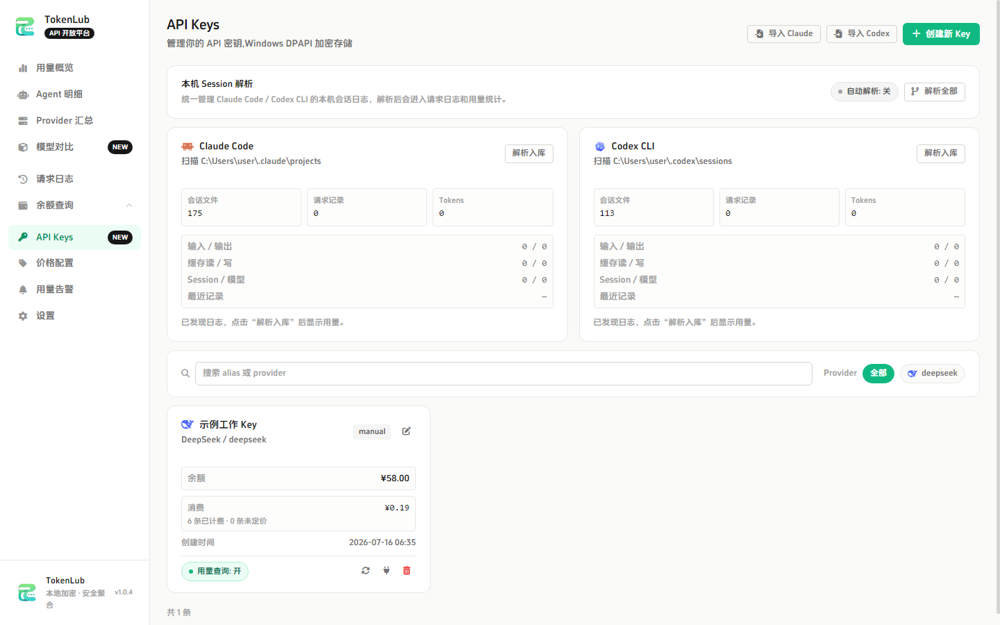
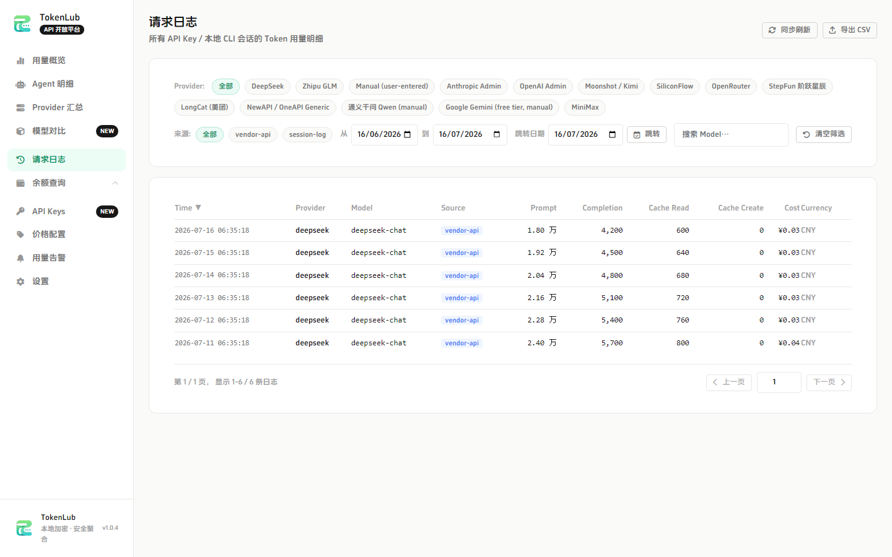
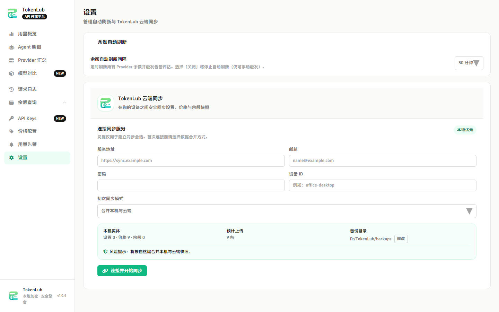

# TokenLub

**TokenLub 是一款 Windows 与 macOS 桌面应用，把多家 LLM 服务商的 Token 用量、余额、模型价格和本机编码会话成本集中到一个本地工作台。**

[English README](./README.en-US.md) · [架构说明](./docs/ARCHITECTURE.md) ·
[Provider 说明](./docs/PROVIDERS.md) · [云端同步说明](./docs/CLOUD-SYNC-GUIDE.md)


## 为什么使用 TokenLub

当你同时使用多个模型服务商、Claude Code、Codex CLI 或 NewAPI 中转服务时，
余额、资源包、请求日志和真实成本很容易散落在不同平台。TokenLub 将它们
收进本地 Electron 应用：数据默认留在本机，API Key 使用 Electron
`safeStorage` 加密，渲染层不会接触明文密钥。

## 功能展示

| 功能                    | 你可以做什么                                                                               |
| ----------------------- | ------------------------------------------------------------------------------------------ |
| 用量概览                | 查看 Token、请求数、成本、缓存命中率和按日/小时趋势                                        |
| Provider 余额           | 查询 DeepSeek、智谱、Moonshot、MiniMax、LongCat、OpenRouter、NewAPI 兼容服务等余额或资源包 |
| API Key 管理            | 本地加密保存 Key，按 Provider 查看状态并安全编辑                                           |
| Claude Code / Codex CLI | 读取本机会话 JSONL 日志，按项目、模型、服务商和日期聚合用量                                |
| 请求日志                | 筛选、分页、查看请求详情并导出 CSV                                                         |
| 模型定价                | 配置模型价格，用高精度 decimal 估算人民币成本                                              |
| 告警                    | 按余额或剩余百分比设置低额度提醒                                                           |
| 多设备同步              | 同步设置、价格和余额快照，支持设备管理、冲突预览和本地备份目录                             |
| 自托管同步服务          | Ubuntu 上一键部署 PostgreSQL + TokenLub + Caddy，支持 HTTPS 域名或 SSH 隧道                |

### 界面一览

| 用量总览                                      | API Key 与本机会话                                |
| --------------------------------------------- | ------------------------------------------------- |
|  |  |

| 请求日志                                         | 云端同步设置                                          |
| ------------------------------------------------ | ----------------------------------------------------- |
|  |  |

## 1.0.5 最新版本

本次版本新增可选本地备份目录、Ubuntu 一键同步服务部署脚本，以及完整的
服务器健康检查、备份、升级和卸载命令。

### Windows 下载

- [安装版 TokenLub-1.0.5-x64.exe](https://github.com/2488652el/TokenLub/releases/download/v1.0.5/TokenLub-1.0.5-x64.exe)
- [便携版 TokenLub-1.0.5-portable.exe](https://github.com/2488652el/TokenLub/releases/download/v1.0.5/TokenLub-1.0.5-portable.exe)
- [GitHub Release v1.0.5](https://github.com/2488652el/TokenLub/releases/tag/v1.0.5)

本地构建产物位于 `artifacts/dist/`；正式 Windows 构建命令为：

```bash
npm run dist:win
```

## 快速开始

### 环境要求

- Windows 10/11 或 macOS 12+
- Node.js 24.x（与 `.nvmrc` 一致）
- npm 11+

### 安装依赖并启动

```bash
npm install
npm run dev
```

如果全新 Windows 环境缺少 Visual Studio Build Tools，导致
`better-sqlite3` 安装失败，可执行：

```bash
npm install --ignore-scripts
node scripts/postinstall-better-sqlite3.cjs
```

### 开发检查

```bash
npm run typecheck
npm run lint
npm run test
npm run build
```

## 一键部署云端同步服务

在 Ubuntu 22.04/24.04 上，准备好域名和 80/443 端口后：

```bash
sudo bash ops/one-click/install.sh \
  --repo-url https://github.com/2488652el/TokenLub.git \
  --ref v1.0.5 \
  --domain sync.example.com \
  --email admin@example.com
```

没有域名时可使用 SSH 隧道模式：

```bash
sudo bash ops/one-click/install.sh \
  --repo-url https://github.com/2488652el/TokenLub.git \
  --ref v1.0.5 \
  --ssh-only
```

安装完成后可使用 `tokenlub-sync health`、`logs`、`backup`、`upgrade` 和
`uninstall` 管理服务。完整前置条件和安全边界见
[一键部署文档](./docs/ONE-CLICK-SERVER.md)。

## 安全与数据边界

- `contextIsolation: true`、`sandbox: true`、`nodeIntegration: false`
- IPC 入参在主进程侧校验，主进程负责 SQLite、Provider 请求和本机文件读取
- API Key 使用 Electron `safeStorage` 本地加密，渲染层不接收明文 Key
- 本机日志解析只读 JSONL 文件，不修改、不删除原始日志
- 不在源码、日志或文档中写入密钥、token 或 `.env` 内容

## 项目结构

```text
src/main/       Electron 主进程：SQLite、Provider、IPC、调度器
src/preload/    暴露给渲染层的安全桥
src/renderer/   React 页面、布局、图表和表单
src/shared/     共享类型、IPC 契约和纯工具函数
tests/          Vitest 单元测试与 Playwright E2E
docs/           架构、Provider、同步与部署文档
build/          electron-builder 静态资源和应用图标
artifacts/      本地生成的安装包和验证产物
```

## 许可证

MIT
