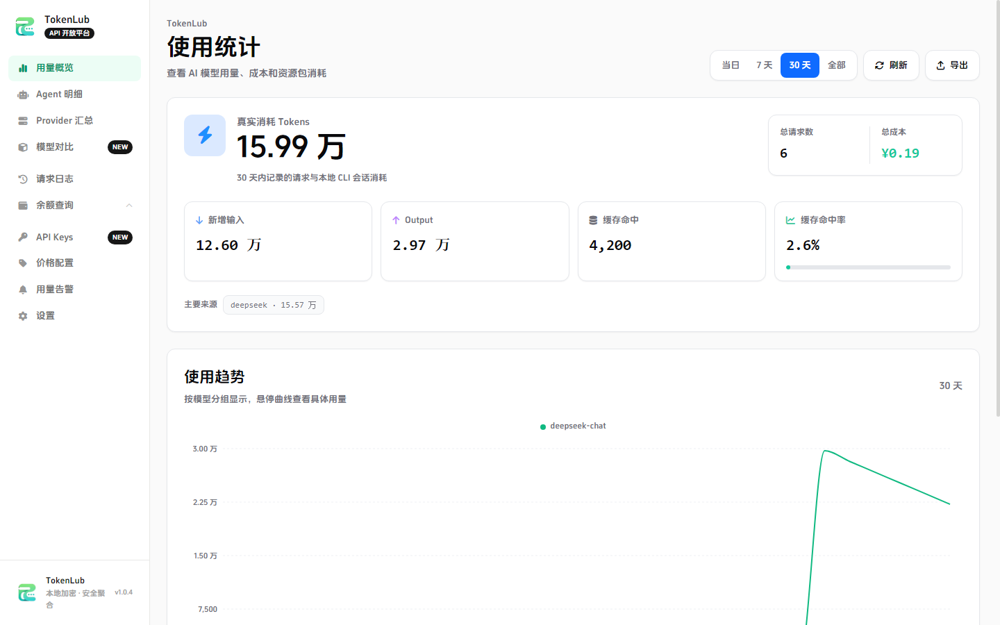
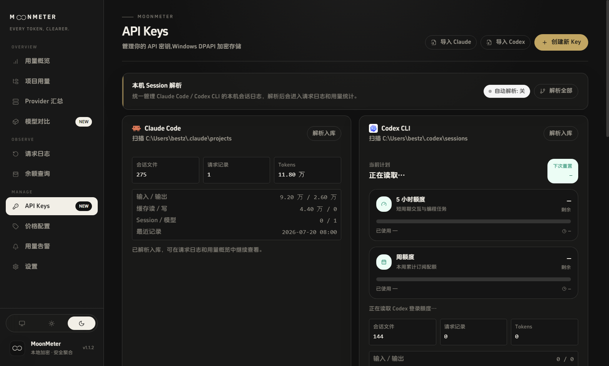
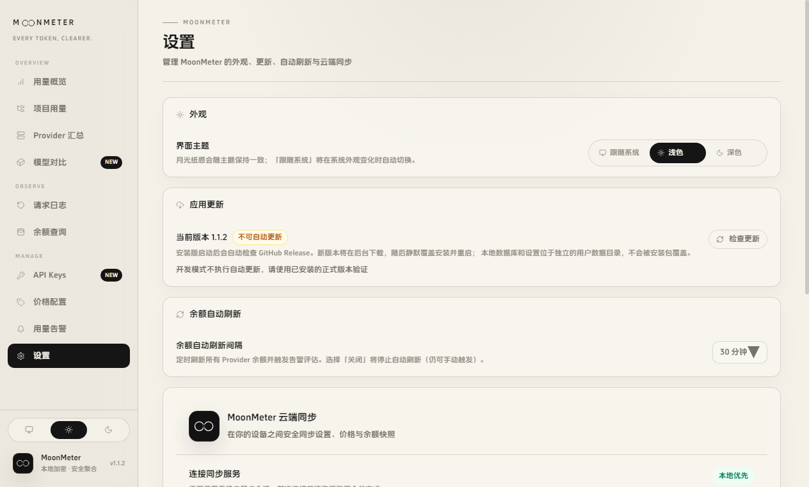

# TokenLub

**TokenLub 是一款 Windows 与 macOS 桌面应用，把多家 LLM 服务商的 Token 用量、余额、模型价格和本机编码会话成本集中到一个本地工作台。**

[English README](./README.en-US.md) · [架构说明](./design/ARCHITECTURE.md) ·
[Provider 说明](./design/PROVIDERS.md) · [云端同步部署](./drive/docs/ONE-CLICK-SERVER.md)



## 为什么使用 TokenLub

当你同时使用多个模型服务商、Claude Code、Codex CLI 或 NewAPI 中转服务时，
余额、资源包、请求日志和真实成本很容易散落在不同平台。TokenLub 将它们
收进本地 Electron 应用：数据默认留在本机，API Key 使用 Electron
`safeStorage` 加密，渲染层不会接触明文密钥。

## 功能展示

| 功能                    | 你可以做什么                                                                               |
| ----------------------- | ------------------------------------------------------------------------------------------ |
| 用量概览                | 查看 Token、请求数、成本、缓存命中率和按日/小时趋势                                        |
| Provider 余额           | 查询 DeepSeek、智谱、Moonshot、MiniMax、LongCat、OpenRouter、NewAPI 兼容服务等余额或资源包 |
| API Key 管理            | 本地加密保存 Key，按 Provider 查看状态并安全编辑                                           |
| Claude Code / Codex CLI | 按需解析本机会话 JSONL 日志；自动解析由开关控制，打开 API Keys 页面不会触发解析       |
| 请求日志                | 筛选、分页、查看请求详情并导出 CSV                                                         |
| 模型定价                | 配置模型价格，用高精度 decimal 估算人民币成本                                              |
| 告警                    | 按余额或剩余百分比设置低额度提醒                                                           |
| 多设备同步              | 同步设置、价格和余额快照，支持设备管理、冲突预览和本地备份目录                             |
| 自托管同步服务          | Ubuntu 上一键部署 PostgreSQL + TokenLub + Caddy，支持 HTTPS 域名或 SSH 隧道                |

### 界面一览

| 用量总览                                        | API Key 与本机会话                                  |
| ----------------------------------------------- | --------------------------------------------------- |
|  |  |

| 请求日志                                           | 云端同步设置                                            |
| -------------------------------------------------- | ------------------------------------------------------- |
|  |  |

## 1.0.9 最新版本

本次版本重构 API Keys 卡片，使用不同供应商品牌色区分 API 余额、Coding Plan、
Token 资源包、组织用量和聚合网关，并直观展示凭据来源、Key 末位与查询状态。
ChatGPT 订阅额度卡片同步升级，突出当前计划、下次重置时间、5 小时额度和周额度。
模型价格表新增人民币/美元统一显示切换，可按原始币种自动获取汇率并高精度折算，
同时保留原始计价信息，汇率不可用时会给出明确提示。

### Windows 下载

- [安装版 TokenLub-1.0.9-x64.exe](https://github.com/2488652el/TokenLub/releases/download/v1.0.9/TokenLub-1.0.9-x64.exe)
- [便携版 TokenLub-1.0.9-portable.exe](https://github.com/2488652el/TokenLub/releases/download/v1.0.9/TokenLub-1.0.9-portable.exe)
- [GitHub Release v1.0.9](https://github.com/2488652el/TokenLub/releases/tag/v1.0.9)

安装包统一输出到 `demo/tokenlub-<版本号>-<修改说明>-<执行模型>/`。正式
Windows 构建命令为：

```powershell
npm run dist:win -- --change "项目目录分类" --model "GPT-5"
```

`--change` 和 `--model` 为必填项；版本号自动读取 `package.json`。也可分别通过
`TOKENLUB_CHANGE` 和 `TOKENLUB_EXECUTION_MODEL` 环境变量提供。

### GitHub 版本同步

每次打包最新版本时，必须核对本地 `package.json`、GitHub `main` 分支中的
`package.json`、最新 GitHub Release/Tag，以及中英文 README 的版本和下载链接。
GitHub 无法访问时不能视为版本一致。

发现版本不一致时，先更新 `README.md` 和 `README.en-US.md`，再运行
`npm run github:prepare` 与 `npm run github:audit`。人工复核
`github/repository/` 后，只从该目录同步源码，最后更新 Tag、GitHub Release 和
安装包；生成的安装包不提交到 Git 仓库。版本完全一致时不重复上传。

## 快速开始

### 环境要求

- Windows 10/11 或 macOS 12+
- Node.js 24.x（与 `.nvmrc` 一致）
- npm 11+

### 安装依赖并启动

```bash
npm install
npm run dev
```

如果全新 Windows 环境缺少 Visual Studio Build Tools，导致
`better-sqlite3` 安装失败，可执行：

```bash
npm install --ignore-scripts
node code/scripts/postinstall-better-sqlite3.cjs
```

### 开发检查

```bash
npm run typecheck
npm run lint
npm run test
npm run build
```

## 一键部署云端同步服务

在 Ubuntu 22.04/24.04 上，准备好域名和 80/443 端口后：

```bash
sudo bash drive/ops/one-click/install.sh \
  --repo-url https://github.com/2488652el/TokenLub.git \
  --ref v1.0.9 \
  --domain sync.example.com \
  --email admin@example.com
```

没有域名时可使用 SSH 隧道模式：

```bash
sudo bash drive/ops/one-click/install.sh \
  --repo-url https://github.com/2488652el/TokenLub.git \
  --ref v1.0.9 \
  --ssh-only
```

安装完成后可使用 `tokenlub-sync health`、`logs`、`backup`、`upgrade` 和
`uninstall` 管理服务。完整前置条件和安全边界见
[一键部署文档](./drive/docs/ONE-CLICK-SERVER.md)。

## 安全与数据边界

- `contextIsolation: true`、`sandbox: true`、`nodeIntegration: false`
- IPC 入参在主进程侧校验，主进程负责 SQLite、Provider 请求和本机文件读取
- API Key 使用 Electron `safeStorage` 本地加密，渲染层不接收明文 Key
- 本机日志解析只读 JSONL 文件，不修改、不删除原始日志
- 不在源码、日志或文档中写入密钥、token 或 `.env` 内容

## 项目结构

```text
skill/          项目专用 Skill；每个 Skill 使用独立目录和 SKILL.md
code/           TokenLub 桌面端前端、Electron 后端、共享代码和构建脚本
drive/          云同步服务端、Docker、部署文档和运维脚本
plan/           带 YYYYMMDD 时间戳的执行计划与决策记录
design/         架构、Provider 规范、视觉资源和界面截图
demo/           单元/E2E/集成测试、临时脚本和本地构建产物
github/         GitHub 发布准备区、白名单和敏感内容审计工具
```

依赖目录 `node_modules/` 以及 `.git/`、`.claude/`、`.codex/` 等工具状态仍位于
根目录，但都不属于可发布项目内容。发布前运行 `npm run github:prepare`，只从
白名单生成 `github/repository/`，审计通过后再从该目录上传。

## 许可证

MIT
