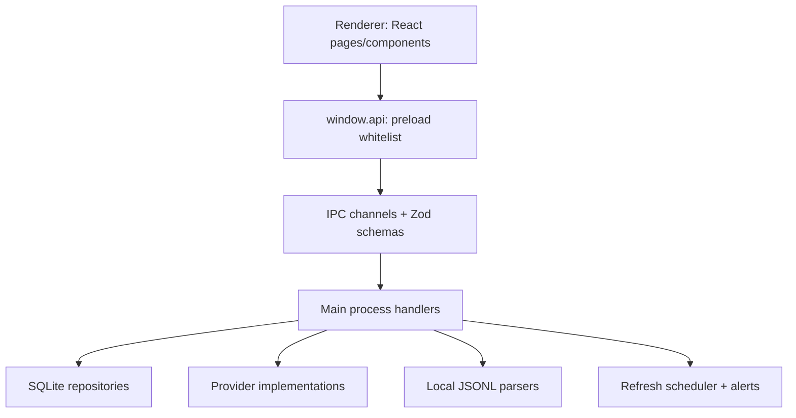

# TokenLub Architecture Sync

本文档用于团队同步当前项目结构、运行边界和协作约定。它不是接口手册，而是让新协作者快速知道“代码应该放哪里、数据怎样流动、哪些边界不能破坏”。

## 1. 一页摘要

TokenLub 是一个 Windows 优先的 Electron 桌面应用，用来聚合多家 LLM 服务商的余额、用量、费用和本地会话日志。

核心架构是标准 Electron 三进程模型：

- Main process：拥有 Node/Electron 权限，负责数据库、密钥、Provider HTTP 请求、本地日志解析、定时刷新和系统能力。
- Preload process：唯一的安全桥，使用 `contextBridge` 暴露白名单 API。
- Renderer process：React UI，只做展示和用户交互，不直接访问 Node、文件系统、数据库或原始 IPC。

当前项目根目录已经按用途收敛：

- `src/`：应用源码。
- `tests/`：自动化测试。
- `docs/`：架构、进度、Provider、审查报告。
- `resources/`、`build/`：运行资源和 electron-builder 资源。
- `scripts/`：维护脚本。
- `artifacts/`：生成物和历史构建产物，已被 git 忽略。
- `.cache/`、`out/`、`node_modules/`：本地缓存、构建输出、依赖，均不应作为源码维护。

## 2. 目录边界

```text
src/
  main/
    crypto/        # safeStorage/密钥加解密
    ipc/           # ipcMain handler 注册
    log-parsers/   # Claude Code / Codex CLI 本地日志发现与解析
    pricing/       # 内置价格目录同步
    providers/     # 各服务商 Provider 实现与 registry
    scheduler/     # 自动刷新、余额告警、用量入库
    store/         # better-sqlite3 仓储与 schema migration
    index.ts       # Electron app 启动入口
    window.ts      # BrowserWindow 创建与安全配置
  preload/
    index.ts       # window.api 白名单
  renderer/
    components/    # 可复用 UI 组件
    layout/        # 应用壳、侧边栏
    pages/         # 页面级视图
    styles/        # Tailwind 和设计 token
  shared/
    types/         # 主进程/渲染进程共享类型
    utils/         # 纯工具函数
    ipc-*.ts       # IPC channel 和 Zod schema
tests/
  unit/            # 按领域分组的单元测试
docs/
  ADVERSARIAL-REPORTS/
artifacts/
  dist/            # 未来 npm run pack/dist/dist:win 输出
  legacy-builds/   # 历史 release* 归档
  visual-audit/    # 视觉验收截图
```

放置规则：

- 新的主进程领域逻辑放到 `src/main/<domain>/`。
- 可复用纯类型和纯函数放到 `src/shared/`。
- 只服务 UI 的代码放到 `src/renderer/`。
- 新测试按领域放到 `tests/unit/<domain>/`。
- 构建产物、截图、临时审查文件不要放项目根目录，统一进入 `artifacts/` 或 `.cache/`。

## 3. 进程与调用链



调用原则：

- Renderer 只能通过 `window.api.*` 调用功能。
- Preload 只暴露稳定、显式、类型化的函数，不做业务逻辑扩张。
- Main handler 负责校验输入、调用仓储/Provider/解析器，并返回安全结果。
- 共享 IPC channel 和 schema 统一放在 `src/shared/`，避免字符串散落在代码里。

## 4. 数据流

### 4.1 API Key 与 Provider 刷新

```text
Renderer form
  -> window.api.keys.add/test/list
  -> ipcMain handler
  -> Zod validation
  -> keys-repo encrypt/decrypt
  -> provider registry
  -> provider balance/usage API
  -> balance_snapshots / usage_records
```

关键点：

- API Key 原文只在 Main process 内短暂出现。
- Renderer 只能看到 `keyTail` 等脱敏信息。
- `extra_credentials` 用于 admin/org 类 Provider 的额外凭证。
- Provider 请求失败会被聚合为 refresh failure，不应让整个刷新流程崩掉。

### 4.2 本地日志解析

```text
Claude Code / Codex CLI JSONL files
  -> discoverAllSessions / syncAllSessions
  -> parser by source
  -> dedupe by message/session key
  -> usage_records(source = "session-log")
  -> dashboard / logs / model compare pages
```

约束：

- 日志解析只读本地 `.jsonl` 文件。
- 不修改、不删除用户本地日志。
- 同步状态通过 `log_sync_state` 增量记录。

### 4.3 费用计算

```text
usage slice
  -> pricing lookup
  -> calcCost
  -> usage_records.cost
  -> dashboard/provider/model aggregates
```

价格来源包括内置目录和用户配置。涉及金额计算时优先使用 `src/shared/utils/money.ts`，避免浮点误差扩散。

## 5. SQLite 存储

数据库由 `better-sqlite3` 管理，文件位于 Electron `app.getPath('userData')` 下的 `tokenlub.db`。

主要表：

- `api_keys`：加密后的 Provider 凭证和元数据。
- `balance_snapshots`：余额快照。
- `usage_records`：API 用量和本地日志解析后的统一用量记录。
- `pricing_entries`：模型价格。
- `alert_rules` / `alert_events`：余额告警规则和触发记录。
- `log_sync_state`：本地日志增量同步状态。
- `app_settings`：非敏感设置。
- `schema_version`：内联 migration 版本。

迁移逻辑目前在 `src/main/store/db.ts` 内联执行。修改 schema 时必须：

- 增加 version gate。
- 保持旧数据库可升级。
- 为关键 dedupe、聚合或 schema 行为补测试。

## 6. Provider 模型

Provider 统一注册在 `src/main/providers/registry.ts`。

新增 Provider 的推荐步骤：

1. 在 `src/main/providers/<provider-id>/index.ts` 实现 Provider。
2. 使用共享类型中的 Provider 接口描述 manifest、balance、usage、testConnection 能力。
3. 在 `registry.ts` 引入并加入 `BUILTIN`。
4. 如果涉及价格，补充 pricing catalog 或用户配置路径。
5. 在 `tests/unit/providers/` 添加最小行为测试。

Provider 类型大致分为：

- `token-plan`：预付费或套餐余额。
- `third-party`：第三方聚合平台余额/用量。
- `admin-org`：组织或管理后台级用量 API。
- `newapi-generic`：NewAPI/OneAPI 兼容接口。
- `manual`：没有 API 时由用户手动录入。

## 7. 前端结构

路由入口在 `src/renderer/App.tsx`，页面放在 `src/renderer/pages/`。

当前页面包括：

- Dashboard：总览。
- AgentDetail：Agent/项目维度分析。
- ProviderSummary：Provider 汇总。
- ModelCompare：模型对比。
- RequestLogs：用量记录。
- SessionParse：本地会话解析。
- BalanceQuery：余额查询。
- ApiKeys：密钥管理。
- PricingConfig：价格配置。
- UsageAlerts：告警。
- Settings：设置。

前端约束：

- 不直接读取文件系统。
- 不直接保存或展示完整密钥。
- 页面级状态优先靠 IPC 拉取，复杂共享状态再抽到 store。
- UI 组件保持在 `components/`，页面编排保持在 `pages/`。

## 8. 安全边界

必须保持的安全默认值：

- `contextIsolation: true`
- `sandbox: true`
- `nodeIntegration: false`
- Renderer 无 `ipcRenderer` 原始访问权。
- 外部链接需要经过协议白名单。
- `shell.openPath` 只允许打开已验证为目录的路径，避免 Windows 上执行文件。
- 本地日志解析只读。
- 密钥只在 Main process 解密，Renderer 只接收脱敏结果。

## 9. 构建与产物

常用命令：

```bash
npm run dev
npm run typecheck
npm test
npm run lint
npm run build
npm run pack
npm run dist:win
```

产物位置：

- `out/`：`electron-vite build` 输出。
- `artifacts/dist/`：electron-builder 打包输出。
- `artifacts/legacy-builds/`：历史 root-level `release*` 归档。
- `.cache/`：TypeScript incremental build info 等本地缓存。

协作时不要把安装包、unpacked app、截图、临时报告放回根目录。

## 10. 测试与验收

常规验收顺序：

```bash
npm run typecheck
npm test
npm run lint
npm run build
```

改动建议：

- Provider、价格、日志解析、数据库 dedupe：必须补单元测试。
- IPC 新增/变更：同步更新 `ipc-channels.ts`、`ipc-schemas.ts`、preload API 和相关测试。
- UI 改动：至少跑 lint/build；关键布局改动应保留视觉验收截图到 `artifacts/visual-audit/`。
- Schema 改动：必须验证旧数据升级路径，不要只测新库。

## 11. 协作注意事项

- 小步修改，避免跨层大重构。
- 业务逻辑不要写进 React 页面；页面只做编排和交互。
- 不要绕过 preload 直接暴露 Node/Electron 能力。
- 不要新增未声明的网络调用、遥测或 analytics。
- 不要把 secrets、token、`.env` 内容写入代码、日志或文档。
- 如果需要凭证测试，用环境变量或本机安全存储传入。
- 新文件先判断归属：`main`、`renderer`、`shared`、`tests`、`docs`、`scripts`、`artifacts`。
